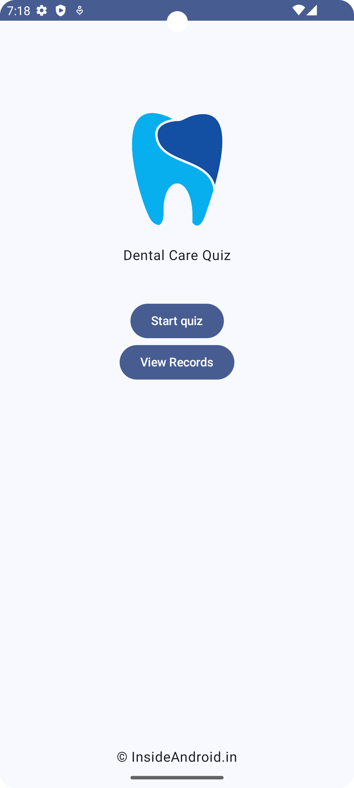
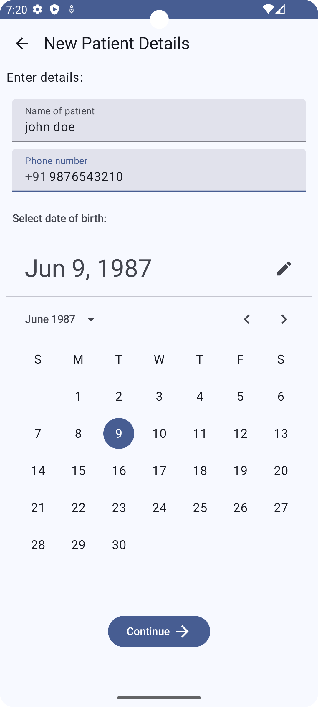
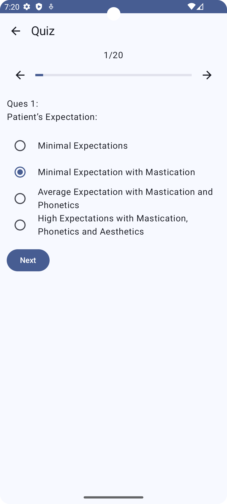
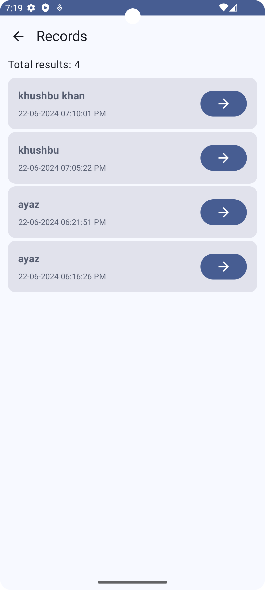
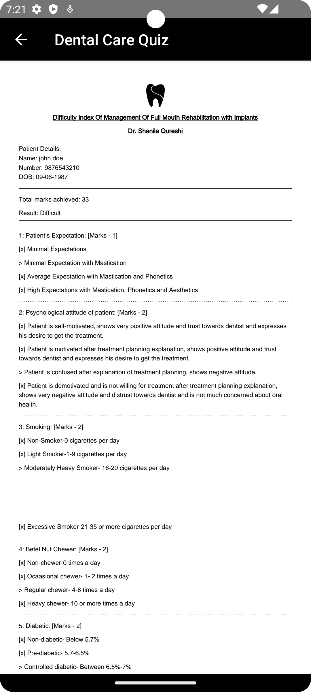
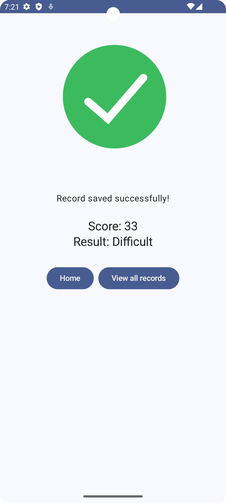

# Dental-quiz
Dental Quiz for detecting difficulty index for full mouth rehabilitation using implants

## Full Mouth Rehabilitation Difficulty Index with Implants

**Description:**

This project provides dentists with a user-friendly android app to assess the difficulty index of full mouth rehabilitation using implants. Dentists will have to go through a 20-question quiz based on patient information, calculating a score that indicates the expected difficulty level.

**Features:**

* **Quiz-based assessment:** Dentists can enter basic patient details and answer a series of 20 questions to determine the difficulty index.
* **Scoring system:** Each quiz answer is assigned points, and the final score is calculated to provide a difficulty level:
    * 0-15 points: Very Easy
    * 16-30 points: Easy
    * 31-45 points: Difficult
    * 46-60 points: Very Difficult
* **PDF report generation:** Upon quiz completion, a PDF report is generated and saved locally. This report includes all answers and the final difficulty assessment.

**Screenshots:**

| Section        | Screenshot                                              |
|----------------|-------------------------------------------------------|
| Home Screen            |  |
| New Patient Entry      |  |
| Quiz      |  |
| Records      |  |
| Report      |  |
| Success      |  |

**Technologies:**

* Lottie: [https://lottiefiles.com/](https://lottiefiles.com/)
* iTextPDF: [https://itextpdf.com/](https://itextpdf.com/) (for creating PDFs)
* PDF Viewer: [https://github.com/afreakyelf/Pdf-Viewer](https://github.com/afreakyelf/Pdf-Viewer)
* Sugar ORM: [https://satyan.github.io/sugar/](https://satyan.github.io/sugar/) (for storing quiz results)

**Installation:**

1. Clone the repository:

   ```bash
   git clone https://github.com/qureshiayaz29/Dental-quiz.git 
   ```

2. Sync project with Gradle files.

**Usage:**

1. Run the application.
2. Enter patient information on the new entry screen.
3. Answer the 20 questions accurately.
4. Upon completion, you'll receive a difficulty rating and the option to generate a PDF report from reports page.

**Contributing:**

We encourage contributions to this project. Feel free to fork the repository, make changes, and submit pull requests.

**License:**

This project is licensed under the [MIT LICENSE] license.
